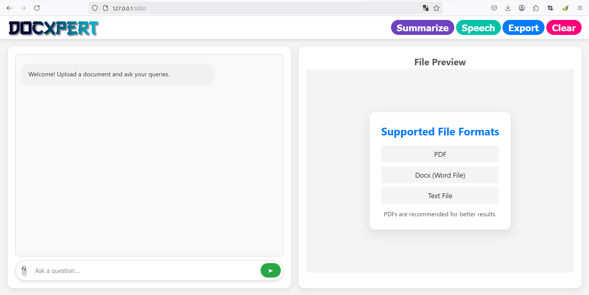
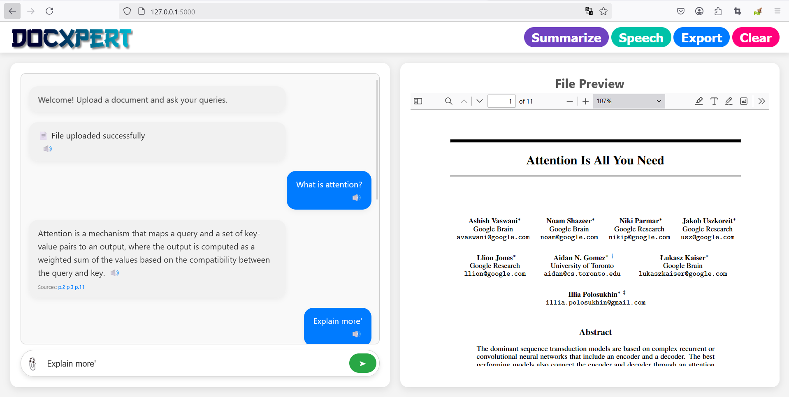

# 📄 **Docxpert: Document Query Bot with RAG + TTS + Summarization**

**Docxpert** is an AI-powered chatbot designed to query and interact with documents using **Retrieval-Augmented Generation (RAG)**. With support for **PDF**, **Word**, and **Text** files, it delivers intelligent, context-aware responses, **Text-to-Speech** and **Document Summarization**.

It uses **OpenAI's API** for natural language processing, **ChromaDB** for fast vector search, and a **Flask server** with an intuitive UI.

---
<p align="center">
    
  
</p>

---

## 🚀 **Try It on HuggingFace Spaces**
👉 [Launch App](https://huggingface.co/spaces/Rahul-Samedavar/Docxpert)


---

## 🔥 **Features**

✅ **Multi-File Support:**  
- Upload and query **PDF**, **Word (.docx)**, and **Text (.txt)** files.

✅ **Context-Aware Chat:**  
- Conversations maintain flow with memory of previous queries.

✅ **Document Preview with Navigation:**  
- Embedded viewer with **clickable source references** for fast navigation.

✅ **Temporary Session Memory:**  
- Sessions persist until server restarts, allowing page reloads without data loss.

✅ **Exportable Chat History:**  
- Save your entire chat as a **PDF file** with one click.

✅ **Interact with Multiple Files:**  
- Seamlessly query multiple files at once—no need to clear history.

✅ **Clear Chat Option:**  
- Easily reset conversation context.

✅ **Text-to-Speech Responses:**  
- Click to listen to responses—great for accessibility and hands-free use.

✅ **Document Summarization to PDF:**  
- Summarize uploaded documents with one click and export summaries as PDFs.

---

## ⚙️ **Tech Stack**

- **LLM:** OpenAI GPT  
- **Framework:** LangChain  
- **Backend:** Flask (Python)  
- **Vector Store:** ChromaDB  
- **UI:** HTML, CSS, JavaScript  
- **File Handling:** PyMuPDF, pdfkit, python-docx, docx2txt  

---

## 🛠️ **Installation & Setup**

### 1️⃣ Clone the Repository
```bash
git clone https://github.com/Rahul-Samedavar/Docxpert.git
cd Docxpert
```

### 2️⃣ Create Virtual Environment
```bash
python -m venv env
source env/bin/activate  # Linux/macOS
env\Scripts\activate     # Windows
```

create a file named keys.py and add you OpenAI key as
```python 
import os

os.environ['OPENAI_API_KEY'] = "Your OpenAI API key"
os.environ['OPENAI_MODEL'] = "gpt-3.5-turbo"
```

### 3️⃣ Install Dependencies
```bash
pip install -r requirements.txt
```

### 4️⃣ Run the App
```bash
python app.py
```
Then open:  
```
http://127.0.0.1:5000
```

---


## 📜 **License**

This project is licensed under the [**MIT License**](LICENSE).

---
